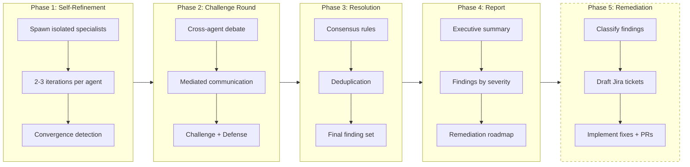
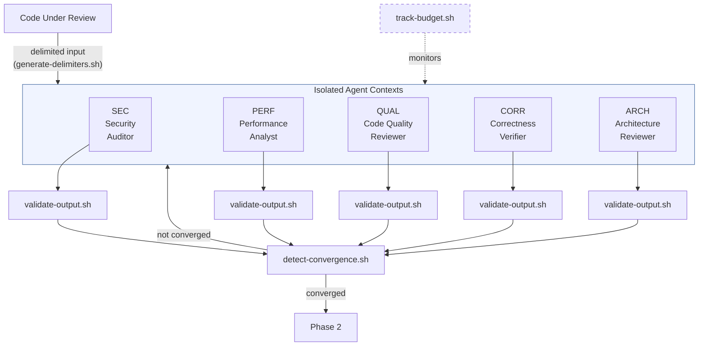
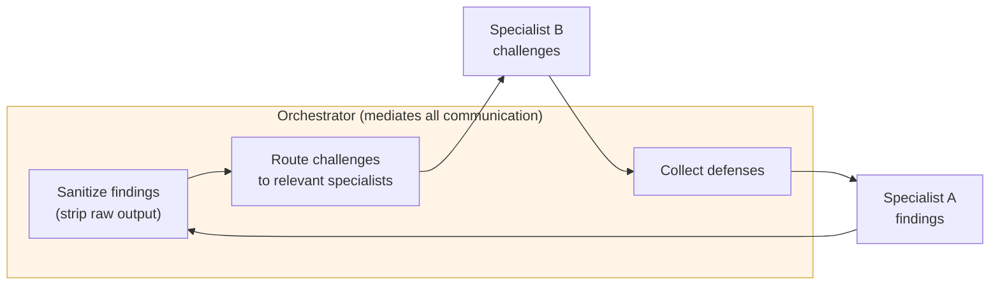
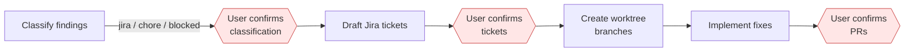
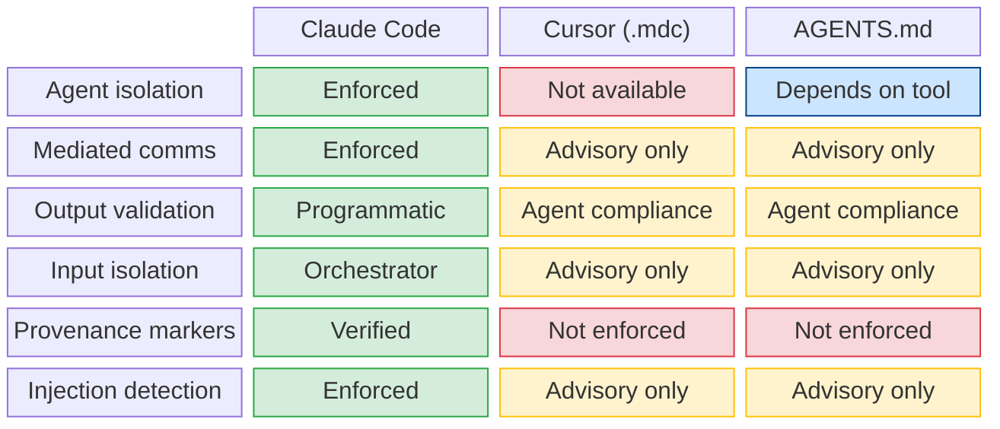
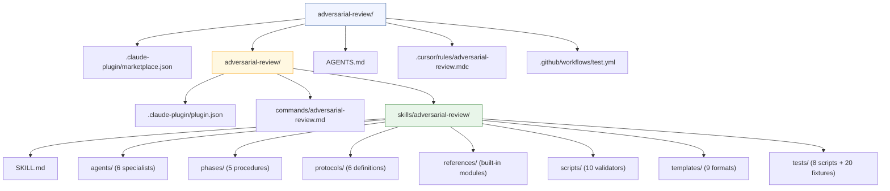

# Adversarial Review

Multi-agent adversarial code review with isolated specialists, programmatic validation, and consensus-based findings.

This plugin orchestrates independent specialist agents who review code from different perspectives, debate their findings through structured challenge rounds, and surface only validated, high-confidence issues through consensus.

## How It Works



> Phase 5 (dashed) only runs when `--fix` is specified.

### Change-Impact Analysis (`--diff`)

When `--diff` is specified, agents receive enriched input: the git diff, changed files, and a grep-based change-impact graph showing callers and callees of modified symbols. This helps specialists trace side effects of changes across the codebase.

### Triage Mode (`--triage`)

When `--triage <source>` is specified, agents evaluate external review comments (from CodeRabbit, human reviewers, or PR conversations) instead of performing independent review. Each comment receives a verdict (Fix/No-Fix/Investigate) with confidence levels and technical analysis.

### Phase 1: Self-Refinement

Each specialist reviews the code independently in full isolation. No specialist sees another's output. Each agent self-refines through 2-3 iterations with convergence detection.



### Phase 2: Challenge Round



Agents never see each other's raw output. The orchestrator strips provenance markers, validates structure, and mediates every exchange.

**Single-specialist mode:** When only 1 specialist is active, a devil's advocate agent challenges the findings instead.

### Phase 3: Resolution

The orchestrator synthesizes challenges and defenses, applies consensus rules, deduplicates findings via `deduplicate.sh`, and produces the final validated finding set.

### Phase 4: Report

Generates a structured report with 9 sections: executive summary, validated findings by severity (Critical/Important/Minor/Style), dismissed findings with rationale, challenge round highlights, co-located findings, and a remediation roadmap.

### Phase 5: Remediation (optional, `--fix`)



Every step requires explicit user confirmation. The orchestrator never pushes, force-pushes, or targets main/master directly.

## Specialists

| Specialist | Flag | Focus Area |
|-----------|------|------------|
| Security Auditor | `--security` | Vulnerabilities, injection, auth, crypto, OWASP Top 10 |
| Performance Analyst | `--performance` | Complexity, memory, I/O, caching, scalability |
| Code Quality Reviewer | `--quality` | Maintainability, SOLID, patterns, readability |
| Correctness Verifier | `--correctness` | Logic errors, edge cases, race conditions, invariants |
| Architecture Reviewer | `--architecture` | Coupling, cohesion, boundaries, extensibility |

Default: all 5 specialists. Use flags to select specific ones.

## Installation

### Claude Code Plugin (Full Feature Set)

**Option A: Via `/plugin` commands** (from inside a Claude Code session):

```
# One-time marketplace registration
/plugin marketplace add ugiordan/adversarial-review

# Install globally (works in every project)
/plugin install adversarial-review@ugiordan-adversarial-review
```

**Option B: Manual setup** (if `/plugin` commands are unavailable):

1. Clone the marketplace repo:
```bash
git clone https://github.com/ugiordan/adversarial-review.git \
  $HOME/.claude/plugins/marketplaces/ugiordan-adversarial-review
```

2. Copy the plugin to the cache:
```bash
mkdir -p $HOME/.claude/plugins/cache/ugiordan-adversarial-review/adversarial-review/1.0.0
rsync -a $HOME/.claude/plugins/marketplaces/ugiordan-adversarial-review/adversarial-review/ \
  $HOME/.claude/plugins/cache/ugiordan-adversarial-review/adversarial-review/1.0.0/
cp $HOME/.claude/plugins/marketplaces/ugiordan-adversarial-review/.claude-plugin/marketplace.json \
  $HOME/.claude/plugins/cache/ugiordan-adversarial-review/adversarial-review/1.0.0/.claude-plugin/
```

3. Add to `~/.claude/settings.json`:
```json
{
  "enabledPlugins": {
    "adversarial-review@ugiordan-adversarial-review": true
  },
  "extraKnownMarketplaces": {
    "ugiordan-adversarial-review": {
      "source": {
        "source": "git",
        "url": "https://github.com/ugiordan/adversarial-review.git"
      }
    }
  }
}
```

4. Add to `~/.claude/plugins/installed_plugins.json` (inside the `"plugins"` object):
```json
"adversarial-review@ugiordan-adversarial-review": [
  {
    "scope": "user",
    "installPath": "<HOME>/.claude/plugins/cache/ugiordan-adversarial-review/adversarial-review/1.0.0",
    "version": "1.0.0",
    "installedAt": "<ISO-8601-timestamp>",
    "lastUpdated": "<ISO-8601-timestamp>",
    "gitCommitSha": "<current-commit-sha>"
  }
]
```

After installation, start a new session. The skill activates automatically when relevant, or invoke directly via `/adversarial-review`.

To update later:
```
/plugin update adversarial-review
```

### Cursor (Degraded Single-Agent Mode)

```bash
# Clone the repo
git clone https://github.com/ugiordan/adversarial-review.git $HOME/.adversarial-review

# Copy rules to your project
mkdir -p .cursor/rules
cp $HOME/.adversarial-review/.cursor/rules/adversarial-review.mdc .cursor/rules/
```

Cursor cannot spawn isolated sub-agents. The plugin adapts to a sequential persona mode where the agent role-plays each specialist in sequence.

### AGENTS.md (Universal)

```bash
# Clone the repo
git clone https://github.com/ugiordan/adversarial-review.git $HOME/.adversarial-review
```

Reference or inline `AGENTS.md` in your AI tool's context. Feature set depends on tool capabilities.

## Usage

```
/adversarial-review [files/dirs] [flags]
```

### Mode Flags

| Flag | Effect |
|------|--------|
| `--quick` | 2 specialists (SEC + CORR), 2 iterations, 200K budget |
| `--thorough` | All 5 specialists, 3 iterations, 800K budget |
| `--delta` | Re-review only changes since last review |
| `--save` | Write report to `docs/reviews/YYYY-MM-DD-<topic>-review.md` |
| `--fix` | Enable Phase 5 (remediation with Jira drafts, worktree branches, PRs) |
| `--budget <N>` | Override default 500K token budget |
| `--force` | Override 200-file hard ceiling |
| `--diff` | Enable diff-augmented input with change-impact graph |
| `--diff --range <range>` | Specify git commit range (e.g., `main..HEAD`) |
| `--triage <source>` | Evaluate external review comments (`pr:<N>`, `file:<path>`, `-`) |
| `--gap-analysis` | Include coverage gap analysis in triage report |
| `--strict-scope` | Reject (not demote) out-of-scope findings and patches |
| `--fix --dry-run` | Preview remediation without writing anything |

### Reference Module Flags

| Flag | Effect |
|------|--------|
| `--list-references` | List all discovered reference modules with metadata |
| `--update-references` | Update modules that have a `source_url` (interactive) |
| `--update-references --check-only` | Check for available updates without applying |

### Examples

```bash
# Review staged changes with all specialists
/adversarial-review

# Security-focused review of specific files
/adversarial-review src/auth/ --security

# Quick review of recent changes
/adversarial-review --quick --delta

# Thorough review with report saved and fixes proposed
/adversarial-review src/ --thorough --save --fix

# Triage PR review comments
/adversarial-review --triage pr:42

# Triage comments from a file
/adversarial-review --triage file:reviews/comments.json

# Review with change-impact analysis
/adversarial-review src/ --diff

# Combined: triage PR comments with diff context
/adversarial-review --triage pr:42 --diff --thorough
```

## Reference Modules

The review is enriched with pluggable reference modules — curated knowledge bases that specialists cross-check their findings against during self-refinement (iteration 2+).

### Built-in Modules (Security)

| Module | Description |
|--------|-------------|
| `owasp-top10-2025` | OWASP Top 10:2025 vulnerability verification patterns |
| `agentic-ai-security` | OWASP Agentic AI risks ASI01-ASI10 |
| `asvs-5-highlights` | ASVS 5.0 key requirements by verification level |
| `k8s-security` | Kubernetes/operator security patterns with false positive checklists |

### Custom Modules

Add your own modules at:
- **User-level** (all projects): `~/.adversarial-review/references/<specialist>/`
- **Project-level** (repo-specific): `.adversarial-review/references/<specialist>/`

See `references/README.md` for the module format and authoring guidelines.

### Updating Modules

```bash
# Check for updates
/adversarial-review --update-references --check-only

# Update interactively
/adversarial-review --update-references

# List all discovered modules
/adversarial-review --list-references
```

## Guardrails

The review enforces programmatic guardrails across agent behavior, cost, safety, and output quality:

| Guardrail | Effect |
|-----------|--------|
| Scope confinement | Findings on files outside the review target are demoted or rejected |
| Iteration hard cap | Agents force-stopped after MAX_ITERATIONS (prevents infinite loops) |
| Budget enforcement | Review stops when token budget is exhausted |
| Per-agent budget cap | No single agent can consume > 150% of its fair share |
| Evidence threshold | Findings with < 100 chars of evidence auto-demoted to Minor |
| Destructive pattern check | Recommended fixes scanned for rm -rf, DROP TABLE, force-push, etc. |
| Severity inflation detection | Warning when > 50% of an agent's findings are Critical |

Use `--strict-scope` to reject (not demote) out-of-scope findings.
Use `--fix --dry-run` to preview remediation without writing anything.

See `protocols/guardrails.md` for full definitions and constants.

## Security Properties by Install Path

The three installation paths provide different security guarantees:



The full multi-agent architecture with enforced isolation is only available in Claude Code.

## Repository Structure



## Programmatic Validation

All agent outputs are validated through bash scripts -- not just LLM judgment:

| Script | Purpose |
|--------|---------|
| `validate-output.sh` | Validates finding structure, detects injection attempts |
| `detect-convergence.sh` | Checks if finding set is stable between iterations |
| `deduplicate.sh` | Removes duplicate findings across specialists |
| `track-budget.sh` | Token budget initialization, tracking, and estimation |
| `generate-delimiters.sh` | Produces unique delimiters for code isolation |
| `build-impact-graph.sh` | Builds change-impact graph from git diff (callers/callees of changed symbols) |
| `parse-comments.sh` | Normalizes external review comments into structured format |
| `validate-triage-output.sh` | Validates triage finding format (verdicts, confidence, severity) |
| `_injection-check.sh` | Shared injection detection logic (sourced by both validators) |
| `discover-references.sh` | Module discovery, frontmatter parsing, filtering, dedup, staleness, token counting |
| `update-references.sh` | Fetch remote modules by `source_url`, compare versions, interactive update |

## Testing

```bash
cd adversarial-review/skills/adversarial-review
bash tests/run-all-tests.sh
```

Test suite covering validation, injection resistance, convergence detection, budget tracking, deduplication, reference module discovery, and single-agent pipeline integration.

## Dependencies

- `bash` 4.0+
- `python3` (JSON serialization and unicode normalization)
- `git` (for `--diff` change-impact analysis)
- GitHub MCP tools (optional, for `--triage pr:<N>`)
- Claude Code Agent tool (for full multi-agent feature set)
- No npm or pip packages required

## License

Apache-2.0
