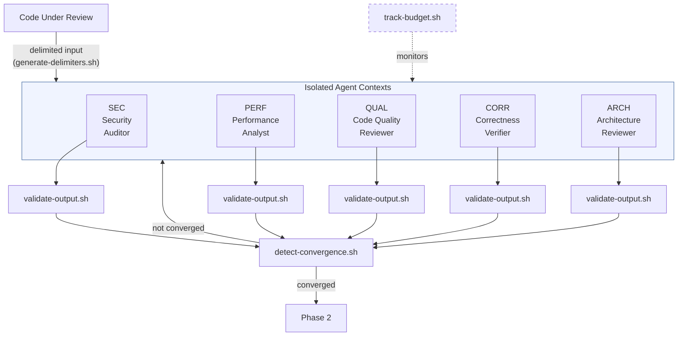
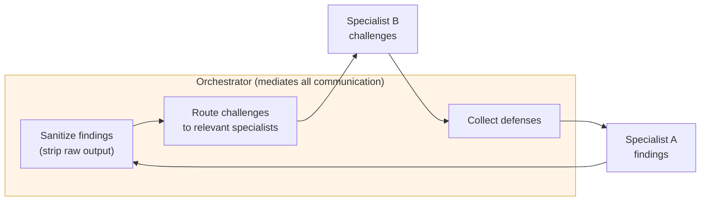

# Multi-Agent Isolation

Agent isolation is the core security property of the system. It ensures each specialist forms independent judgments without influence from other agents.

## Isolation model



## How isolation works in Claude Code

Claude Code's Agent tool spawns sub-agents as independent processes. Each specialist agent:

- Runs in its own agent context with a fresh conversation
- Receives only the code under review (wrapped in unique delimiters) and its own prompt
- Has no mechanism to access other agents' outputs
- Produces output that goes through the orchestrator before any other agent sees it

The orchestrator (SKILL.md) coordinates all communication. It:

1. Spawns agents with isolated inputs
2. Collects and validates outputs
3. Sanitizes findings before routing them as challenges
4. Strips provenance markers and raw output from cross-agent messages

## Mediated communication

During Phase 2 (challenge round), agents need to see each other's findings to challenge them. This happens through the orchestrator:



Agents never see each other's raw output. They see sanitized finding summaries. This prevents:

- Prompt injection via crafted findings
- Context manipulation through embedded instructions
- Information leakage from one agent's internal reasoning

## Delimiter-based input isolation

Each specialist receives code wrapped in unique delimiters generated per-session:

```
<<<REVIEW_INPUT_a7f3b2c1>>>
[code under review]
<<<END_REVIEW_INPUT_a7f3b2c1>>>
```

Delimiters are:

- Generated randomly per session (not predictable)
- Unique per specialist (different delimiters for each agent)
- Validated in output (agent output cannot contain its own delimiters)

This prevents the reviewed code from containing fake delimiter boundaries that could trick agents into treating injected content as instructions.

## Degraded mode (Cursor, AGENTS.md)

In tools without sub-agent support, isolation is advisory only:

| Property | Multi-agent (Claude Code) | Single-agent (degraded) |
|----------|--------------------------|------------------------|
| Context separation | Enforced (separate processes) | Not available (same context) |
| Output sanitization | Enforced (orchestrator strips) | Advisory (agent compliance) |
| Delimiter isolation | Enforced (unique per agent) | Advisory (same context) |
| Provenance verification | Enforced (validated markers) | Not enforced |
| Injection detection | Programmatic (bash scripts) | Depends on shell access |

In degraded mode, the agent role-plays each specialist sequentially. There is no enforcement boundary. The agent is asked to avoid carrying context between personas, but this is not guaranteed.
