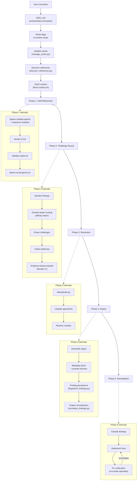

# Design Overview

Adversarial Review is a multi-agent system where independent specialist agents analyze code or strategy documents, debate their findings, and produce a validated report. The core design principle is that no single agent's judgment is trusted: findings must survive structured adversarial scrutiny.

## Architecture

The system flows from user invocation through flag parsing, cache initialization, and context loading, then into the 5-phase review pipeline. Each phase has internal subcomponents shown in the expanded boxes below. The main pipeline is linear (phases run sequentially), but within each phase there are loops and conditional paths. Phase 5 (dashed) is optional.

## Key design decisions

### Why multi-agent?

A single LLM pass produces findings that reflect one perspective. Multiple independent agents:

- Cover different failure modes (security vs. performance vs. correctness)
- Challenge each other's assumptions through structured debate
- Produce findings with transparent agreement levels
- Reduce false positives through adversarial scrutiny

### Why isolation?

Agents run in separate contexts with no access to each other's raw output. This prevents:

- **Anchoring bias**: Seeing another agent's findings before forming your own
- **Conformity pressure**: Adjusting findings to match what others said
- **Output manipulation**: Crafting output to influence another agent's behavior

### Why programmatic validation?

LLM outputs are unpredictable. Bash scripts validate structure, detect injection, and enforce guardrails independently of agent compliance. This means:

- Malformed findings are caught before they reach the report
- Injection attempts in reviewed code don't propagate to agent behavior
- Budget and scope constraints are enforced programmatically, not by asking agents nicely

### Why convergence detection?

Self-refinement without a stopping condition wastes tokens. Convergence detection compares finding sets between iterations and stops when the delta is below threshold. This typically saves 30-40% of the budget compared to fixed iteration counts.

### Why domain-aware routing?

During the challenge round, agents receive a domain affinity hint that maps finding categories to their primary and adjacent domains. This reduces unnecessary Tier 2 reads (full finding files) by guiding agents to focus on findings in their domain. Agents can still challenge any finding, but the routing hint saves 40-60% of cross-agent token consumption compared to agents reading every finding in full.

### Why finding-aware reference selection?

Reference modules are filtered by specialist, but when truncation is needed under budget constraints, modules relevant to actual findings are prioritized. The `--finding-categories` flag lets the orchestrator pass Phase 1 finding categories to `discover_references.py`, which then truncates non-matching modules first. This keeps the most relevant reference material available even under tight budgets.

### Why finding persistence?

Without cross-run tracking, each review is a fresh start. Finding persistence fingerprints each finding based on its content (file, line bucket, title, specialist) and stores history in `.adversarial-review/findings-history.jsonl`. On subsequent runs, findings are classified as new, recurring, resolved, or regressed. This lets teams track whether issues are actually getting fixed and detect regressions.

### Why output normalization?

LLM outputs are non-deterministic. Running the same review twice produces findings with slightly different wording, ordering, and formatting. Normalization canonicalizes the output (consistent ordering, standardized formatting) so meaningful differences stand out from noise. Stability metrics quantify how much variance exists between runs.

### Why prompt versioning?

Agent prompts evolve over time. Without version tracking, there's no way to know which prompt version produced which findings. Content-based hashing in prompt frontmatter enables reproducibility analysis: if findings changed between runs, was it the code or the prompt that changed?

## Component map

| Component | Location | Purpose |
|-----------|----------|---------|
| SKILL.md | `skills/adversarial-review/SKILL.md` | Main orchestration procedure |
| Phases | `phases/` | Per-phase execution procedures |
| Protocols | `protocols/` | Operational rules and constraints |
| Agents | `profiles/<profile>/agents/` | Specialist prompt definitions |
| Templates | `profiles/<profile>/templates/` | Output format definitions |
| References | `profiles/<profile>/references/` | Knowledge base modules |
| Scripts | `scripts/` | Validation and utility scripts |
| Tests | `tests/` | Test suite with fixtures |

## Execution flow

1. **Parse invocation**: Resolve target files, flags, profile, specialists
2. **Initialize cache**: Create temp directory, populate with code and context
3. **Phase 1**: Spawn isolated agents, self-refine with convergence detection
4. **Phase 2**: Mediated cross-agent challenge round
5. **Phase 3**: Deduplicate, classify agreement, resolve verdicts
6. **Phase 4**: Generate structured report
7. **Phase 5** (optional): Classify, draft Jira, implement fixes
8. **Cleanup**: Remove cache, output budget summary
