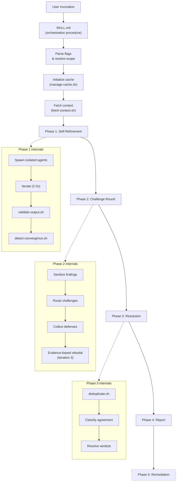

# Design Overview

Adversarial Review is a multi-agent system where independent specialist agents analyze code or strategy documents, debate their findings, and produce a validated report. The core design principle is that no single agent's judgment is trusted: findings must survive structured adversarial scrutiny.

## Architecture

## Key design decisions

### Why multi-agent?

A single LLM pass produces findings that reflect one perspective. Multiple independent agents:

- Cover different failure modes (security vs. performance vs. correctness)
- Challenge each other's assumptions through structured debate
- Produce findings with transparent agreement levels
- Reduce false positives through adversarial scrutiny

### Why isolation?

Agents run in separate contexts with no access to each other's raw output. This prevents:

- **Anchoring bias**: Seeing another agent's findings before forming your own
- **Conformity pressure**: Adjusting findings to match what others said
- **Output manipulation**: Crafting output to influence another agent's behavior

### Why programmatic validation?

LLM outputs are unpredictable. Bash scripts validate structure, detect injection, and enforce guardrails independently of agent compliance. This means:

- Malformed findings are caught before they reach the report
- Injection attempts in reviewed code don't propagate to agent behavior
- Budget and scope constraints are enforced programmatically, not by asking agents nicely

### Why convergence detection?

Self-refinement without a stopping condition wastes tokens. Convergence detection compares finding sets between iterations and stops when the delta is below threshold. This typically saves 30-40% of the budget compared to fixed iteration counts.

## Component map

| Component | Location | Purpose |
|-----------|----------|---------|
| SKILL.md | `skills/adversarial-review/SKILL.md` | Main orchestration procedure |
| Phases | `phases/` | Per-phase execution procedures |
| Protocols | `protocols/` | Operational rules and constraints |
| Agents | `profiles/<profile>/agents/` | Specialist prompt definitions |
| Templates | `profiles/<profile>/templates/` | Output format definitions |
| References | `profiles/<profile>/references/` | Knowledge base modules |
| Scripts | `scripts/` | Validation and utility scripts |
| Tests | `tests/` | Test suite with fixtures |

## Execution flow

1. **Parse invocation**: Resolve target files, flags, profile, specialists
2. **Initialize cache**: Create temp directory, populate with code and context
3. **Phase 1**: Spawn isolated agents, self-refine with convergence detection
4. **Phase 2**: Mediated cross-agent challenge round
5. **Phase 3**: Deduplicate, classify agreement, resolve verdicts
6. **Phase 4**: Generate structured report
7. **Phase 5** (optional): Classify, draft Jira, implement fixes
8. **Cleanup**: Remove cache, output budget summary
