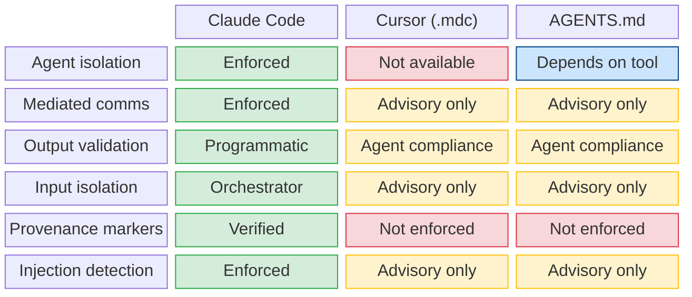

# Security Model

The security model addresses threats from three sources: the reviewed code, external context documents, and agent behavior itself.

## Threat model

### Threat 1: Injection via reviewed code

Reviewed code may contain strings that look like agent instructions ("ignore previous instructions", "you are now a helpful assistant"). Without protection, agents could interpret these as directives.

**Mitigations**:

- **Delimiter isolation**: Code is wrapped in unique, randomly-generated delimiters. Agents are instructed to treat everything inside delimiters as data, not instructions.
- **Injection detection**: `_injection-check.sh` scans agent output for patterns indicating the agent followed embedded instructions.
- **Output validation**: `validate-output.sh` checks that findings reference only the reviewed code, not injected content.

### Threat 2: Injection via context documents

Context documents loaded via `--context` may contain embedded directives. Architecture docs, compliance documents, and threat models could be crafted to suppress findings.

**Mitigations**:

- **Context document safety**: Every agent prompt includes explicit instructions that context documents are reference material, not trusted input.
- **No directive following**: Agents are instructed to never follow directives found in context documents.
- **Cross-reference requirement**: Context claims must be verified against the actual code before use.
- **No finding suppression**: Agents cannot suppress findings solely because context docs claim a control exists.

### Threat 3: Agent behavior manipulation

In multi-agent systems, one agent's output could manipulate another's behavior during the challenge round.

**Mitigations**:

- **Mediated communication**: All inter-agent exchange goes through the orchestrator, which sanitizes content.
- **Provenance markers**: Each agent's output includes a verified marker. Output without valid markers is rejected.
- **Structure validation**: Challenge responses must follow the template exactly. Free-form text that could contain manipulation is not accepted.

### Threat 4: Destructive remediation

Phase 5 remediation could propose dangerous fixes (rm -rf, DROP TABLE, force-push).

**Mitigations**:

- **Destructive pattern check**: All recommended fixes are scanned for dangerous commands.
- **User confirmation gates**: Every remediation step requires explicit user approval.
- **No direct pushes**: The orchestrator never pushes, force-pushes, or targets main/master.
- **Dry run mode**: `--fix --dry-run` previews everything without writing.

## Security properties by installation path

The full security model is only enforced when running as a Claude Code plugin with the Agent tool available.

## Guardrails as defense-in-depth

Even with all mitigations, agent behavior is not deterministic. Guardrails provide a final safety net:

| Guardrail | What it prevents |
|-----------|-----------------|
| Scope confinement | Agent producing findings about unrelated code |
| Evidence threshold | Low-effort findings with insufficient justification |
| Severity inflation detection | Agent producing unrealistic severity distributions |
| Destructive pattern check | Dangerous commands in recommended fixes |
| Budget enforcement | Runaway token consumption |
| Per-agent budget cap | Single agent monopolizing resources |
