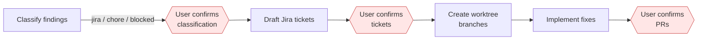

# Remediation

Phase 5 generates and applies fixes for confirmed findings. It requires explicit user confirmation at every step.

## Activation

```bash
# Full review with remediation
/adversarial-review src/ --fix

# Preview without writing anything
/adversarial-review src/ --fix --dry-run
```

## Pipeline



Every red gate requires explicit user confirmation before proceeding.

## Step 1: Classification

Each finding is classified into one of:

| Category | Description |
|----------|-------------|
| **jira** | Needs a tracked ticket (security fixes, breaking changes) |
| **chore** | Simple fix that can be done inline (typos, minor refactors) |
| **blocked** | Cannot be fixed without more context or upstream changes |

The user reviews and confirms the classification before any action.

## Step 2: Jira ticket drafts

For findings classified as `jira`, the system drafts tickets using the Jira template:

- Title, description, acceptance criteria
- Priority mapped from finding severity
- Labels derived from specialist domain

Tickets are presented for review. The user decides which to actually create.

## Step 3: Worktree branches

For findings that will be fixed:

- Each fix gets its own git worktree branch
- Branch names follow the pattern `fix/<finding-id>-<short-description>`
- The orchestrator never pushes, force-pushes, or targets main/master

## Step 4: Implementation

Fixes are implemented in the worktree branches. Each fix is scoped to its finding. The destructive pattern check scans all recommended fixes for dangerous operations (rm -rf, DROP TABLE, force-push, etc.) before applying.

## Dry run mode

Preview what the remediation would do without writing anything:

```bash
/adversarial-review src/ --fix --dry-run
```

This runs the full classification and shows the proposed Jira drafts, branch names, and fix descriptions, but writes no files and creates no branches.

## Strict scope

When `--strict-scope` is active, remediation patches that touch files outside the review target are rejected entirely (not just flagged):

```bash
/adversarial-review src/auth/ --fix --strict-scope
```
