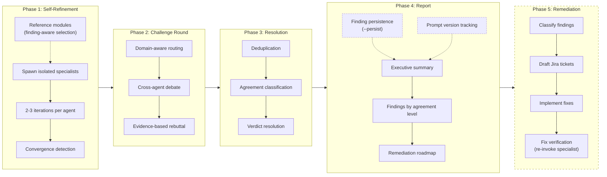
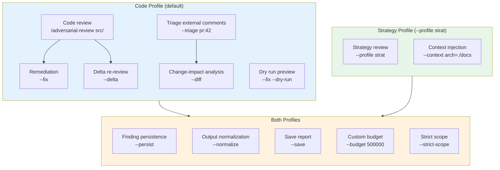

---
hide:
  - navigation
  - toc
---

# Adversarial Review

  

    Multi-agent adversarial code and strategy review. 
    Isolated specialists. Structured debate. Evidence-based resolution.
  

  

    <a href="getting-started/installation/" class="md-button md-button--primary">Get Started</a>
    <a href="https://github.com/ugiordan/adversarial-review" class="md-button">GitHub</a>
  

## What Is This?

Adversarial Review orchestrates independent specialist agents who review code or strategy documents from different perspectives, debate their findings through structured challenge rounds with evidence-based rebuttals, and surface validated findings with transparent agreement labeling.

Unlike single-pass review tools, findings must survive cross-agent scrutiny before reaching the final report. This reduces false positives and catches issues that single-perspective reviews miss.

## How It Works

> Phase 5 (dashed) only runs when `--fix` is specified (code profile only). Finding persistence and prompt version tracking (dotted) are optional (`--persist` flag).

## Two Review Profiles

- **Code Profile** (default)

    ---

    Reviews source code with file:line evidence. 5 specialist agents: Security Auditor, Performance Analyst, Code Quality Reviewer, Correctness Verifier, Architecture Reviewer.

    [:octicons-arrow-right-24: Code review guide](guides/code-reviews.md)

- **Strategy Profile** (`--profile strat`)

    ---

    Reviews strategy documents with text citation evidence and per-document verdicts (Approve/Revise/Reject). 6 specialist agents including Feasibility, User Impact, Scope, and Testability analysts.

    [:octicons-arrow-right-24: Strategy review guide](guides/strategy-reviews.md)

## Key Features

| Feature | Description |
|---------|-------------|
| **Agent isolation** | Each specialist runs in its own context with no access to others' raw output |
| **Mediated communication** | All inter-agent exchange goes through the orchestrator |
| **Convergence detection** | Agents self-refine until their findings stabilize |
| **Evidence-based rebuttal** | Disagreements resolved by citing `file:line` evidence or retracting |
| **Programmatic validation** | 20 bash/python scripts validate structure, detect injection, track budget |
| **Reference modules** | Pluggable knowledge bases (OWASP, ASVS, K8s security) for cross-checking |
| **Triage mode** | Evaluate external review comments (CodeRabbit, human reviewers, PR conversations) |
| **Change-impact analysis** | Git diff with caller/callee graph for tracing side effects |
| **Remediation pipeline** | Jira ticket drafts, worktree branches, PRs with user confirmation gates |

## Use Cases by Profile

## Platform Support

| Feature | Claude Code | Cursor | AGENTS.md |
|---------|------------|--------|-----------|
| Multi-agent isolation | Enforced | Not available | Depends on tool |
| Strategy profile | Full support | Not available | Advisory only |
| Mediated communication | Enforced | Advisory only | Advisory only |
| Output validation | Programmatic | Agent compliance | Agent compliance |
| Injection detection | Enforced | Advisory only | Advisory only |
| Phase 5 remediation | Full support | Limited | Limited |

!!! warning "Cursor limitations"
    Cursor cannot spawn isolated sub-agents, so it runs in **degraded single-agent mode**: the agent role-plays each specialist sequentially without enforcement boundaries. Only the code profile is supported. See [Installation](getting-started/installation.md) for details.
